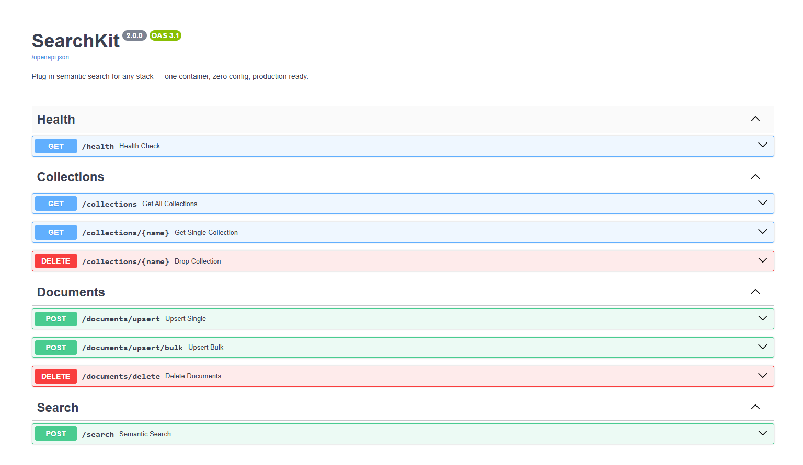

# SearchKit

> **Plug-in vector search for any stack — one container, zero config, production ready.**

A lightweight FastAPI service with **embedded ChromaDB** that gives your app semantic search via simple REST endpoints. No separate vector DB container, no complex setup — just drop it in, point your service at it, and search.

---

## What Can You Build With This?

This service acts as a **dedicated semantic search layer** that sits alongside your main application. Here are some real-world use cases:

🔍 **AI-Powered Search** — replace keyword search in your app with meaning-based search. Users search for _"comfortable running shoes"_ and find relevant products even if the description says _"lightweight athletic footwear"_.

🤖 **RAG (Retrieval-Augmented Generation)** — feed relevant context to your LLM before generating a response. Store your documents here, search by query, pass top results to GPT/Claude as context.

📄 **Document Similarity** — find related articles, tickets, or records. _"Show me support tickets similar to this one"_ or _"find blog posts related to this topic"_.

🛒 **Product Recommendations** — embed product descriptions and find semantically similar items. _"Customers who viewed this also liked..."_ without collaborative filtering.

💬 **FAQ & Chatbot Matching** — match user questions to the closest FAQ entry or support article, even when the wording is completely different.

🏷️ **Smart Tagging & Categorisation** — automatically classify incoming content by comparing it against category embeddings.

---



## Architecture

```
Your Main Service
      │
      ▼  HTTP
searchkit (FastAPI :9000)
   └── ChromaDB (embedded, in-process)
         │
         ▼
   chroma-data (Docker volume)
```

## Quick Start

```bash
docker compose up -d
```

| Service     | URL                        |
| ----------- | -------------------------- |
| Wrapper API | http://localhost:9000      |
| API Docs    | http://localhost:9000/docs |

---

## API Endpoints

### Health

```
GET /health
```

```json
{ "status": "ok", "chromadb": "embedded", "collections": 1 }
```

---

### Insert / Update — Single Document

```
POST /documents/upsert
```

```json
{
  "collection": "default",
  "id": "doc_1",
  "text": "Machine learning is a subset of artificial intelligence",
  "metadata": { "source": "wiki", "topic": "ai" }
}
```

```json
{
  "status": "ok",
  "message": "Upserted document 'doc_1' into 'default'. Total: 1"
}
```

---

### Insert / Update — Bulk Documents

```
POST /documents/upsert/bulk
```

```json
{
  "collection": "default",
  "documents": [
    {
      "id": "doc_1",
      "text": "Machine learning is a subset of AI",
      "metadata": { "source": "wiki" }
    },
    {
      "id": "doc_2",
      "text": "FastAPI is a modern Python web framework",
      "metadata": { "source": "blog" }
    }
  ]
}
```

```json
{ "status": "ok", "message": "Upserted 2 documents into 'default'. Total: 2" }
```

> Both endpoints behave as **upsert** — if the ID exists it gets updated, if not it gets inserted.

---

### Delete Documents

```
DELETE /documents/delete
```

```json
{
  "collection": "default",
  "ids": ["doc_1", "doc_2"]
}
```

```json
{
  "status": "ok",
  "message": "Deleted 2 documents from 'default'. Remaining: 0"
}
```

---

### Semantic Search

```
POST /search
```

```json
{
  "query": "what is artificial intelligence?",
  "top_k": 3,
  "collection": "default",
  "where": { "source": "wiki" }
}
```

```json
{
  "query": "what is artificial intelligence?",
  "total": 1,
  "results": [
    {
      "id": "doc_1",
      "text": "Machine learning is a subset of artificial intelligence",
      "metadata": { "source": "wiki", "topic": "ai" },
      "distance": 0.082
    }
  ]
}
```

> `where` is optional — use it to filter results by metadata fields.

---

### Collections

```
GET    /collections           # list all collections with document counts
GET    /collections/{name}    # get a specific collection
DELETE /collections/{name}    # drop an entire collection
```

---

## Environment Variables

| Variable             | Default                  | Description                       |
| -------------------- | ------------------------ | --------------------------------- |
| `CHROMA_PERSIST_DIR` | `/app/chromadb`          | Path where ChromaDB persists data |
| `EMBEDDING_MODEL`    | `BAAI/bge-small-en-v1.5` | SentenceTransformer model name    |
| `DEFAULT_COLLECTION` | `default`                | Default collection name           |

---

## Capacity Guide

Using the default `BAAI/bge-small-en-v1.5` model (384 dimensions):

| Records | RAM Required |
| ------- | ------------ |
| 100K    | ~1 GB        |
| 500K    | ~4 GB        |
| 1M      | ~8 GB        |
| 2M      | ~16 GB       |

> Recommended for up to **2 million records**. For larger scale, switch to a dedicated ChromaDB or Qdrant server.

---

## Docker Compose

```yaml
services:
  searchkit:
    image: surinderlohat/searchkit:latest
    container_name: searchkit
    restart: unless-stopped
    ports:
      - "9000:9000"
    environment:
      - CHROMA_PERSIST_DIR=/app/chromadb
      - EMBEDDING_MODEL=BAAI/bge-small-en-v1.5
      - DEFAULT_COLLECTION=default
    volumes:
      - chroma-data:/app/chromadb

volumes:
  chroma-data:
```

---

## How Your Main Service Uses This

```python
import httpx

async def insert_document(id: str, text: str, metadata: dict):
    async with httpx.AsyncClient() as client:
        await client.post("http://searchkit:9000/documents/upsert", json={
            "collection": "default",
            "id": id,
            "text": text,
            "metadata": metadata,
        })

async def search(query: str) -> list:
    async with httpx.AsyncClient() as client:
        res = await client.post("http://searchkit:9000/search", json={
            "query": query,
            "top_k": 5,
            "collection": "default",
        })
        return res.json()["results"]
```

Your main service never touches ChromaDB directly — it just calls HTTP endpoints.

---

## Running Locally (Without Docker)

Useful for development and testing before building the Docker image.

### Prerequisites

- Python 3.11+
- pip

### 1. Create Virtual Environment

```bash
cd chroma-service-final
python -m venv .venv

# Linux / Mac
source .venv/bin/activate

# Windows
.venv\Scripts\activate
```

### 2. Install Dependencies

Install CPU-only torch **first** — otherwise pip pulls the CUDA version (~2.5 GB):

```bash
pip install torch==2.3.0+cpu torchvision==0.18.0+cpu \
    --extra-index-url https://download.pytorch.org/whl/cpu

pip install -r requirements.txt
```

### 3. Create Local Config

```bash
cat > .env.local << 'ENVEOF'
CHROMA_PERSIST_DIR=./data/chromadb
EMBEDDING_MODEL=BAAI/bge-small-en-v1.5
SENTENCE_TRANSFORMERS_HOME=./data/models
EMBEDDING_DEVICE=auto
DEFAULT_COLLECTION=default
LOG_LEVEL=DEBUG
LOG_FORMAT=text
MEMORY_WARN_MB=3500
MEMORY_LIMIT_MB=4000
ENVEOF
```

> `.env.local` is already in `.gitignore` — safe to put local values here.

### 4. Run

```bash
export $(cat .env.local | xargs) && uvicorn app.main:app --reload --port 9000
```

`--reload` automatically restarts the server on every code change.

### 5. Test

| URL                          | Description                                   |
| ---------------------------- | --------------------------------------------- |
| http://localhost:9000/docs   | Swagger UI — test all endpoints interactively |
| http://localhost:9000/health | Quick sanity check                            |

### Switching Back to Docker

```bash
# Deactivate venv
deactivate

# Build and run with Docker
docker compose up -d --build
```

> Local `./data/` folder is shared between local and Docker runs — no data loss when switching.

---

## Make Commands

All common tasks are available via `make`. Requires `make` to be installed.

```bash
# Development
make dev          # run locally with hot reload
make run          # run locally without hot reload

# Code Quality
make format       # format code with ruff
make lint         # check lint issues
make lint-fix     # auto fix lint issues
make check        # format + lint before committing

# Docker
make docker-up    # start docker
make docker-build # build and start docker
make docker-down  # stop docker
make docker-logs  # tail container logs
```

> Run `make check` before every commit to catch formatting and lint issues early.

---

## Acknowledgements

This project is built on the shoulders of some fantastic open source tools and models. Huge thanks to the teams and communities behind them:

| Tool                                                                       | What it does in this project                                                       |
| -------------------------------------------------------------------------- | ---------------------------------------------------------------------------------- |
| 🤗 [BAAI/bge-small-en-v1.5](https://huggingface.co/BAAI/bge-small-en-v1.5) | The embedding model that powers semantic search — fast, accurate, and CPU-friendly |
| 🟣 [ChromaDB](https://www.trychroma.com)                                   | The embedded vector store that handles storage, indexing, and similarity search    |
| ⚡ [FastAPI](https://fastapi.tiangolo.com)                                 | The web framework powering the REST API and auto-generated Swagger docs            |
| 🐳 [Docker](https://www.docker.com)                                        | Containerisation that makes the whole service portable and production-ready        |
| 🐙 [GitHub Actions](https://github.com/features/actions)                   | CI/CD pipeline for automated linting, building, and publishing to Docker Hub       |
| 🤗 [Sentence Transformers](https://www.sbert.net)                          | Python library that makes embedding generation simple and model-agnostic           |
| 🔥 [PyTorch](https://pytorch.org)                                          | The deep learning backbone that runs the embedding model                           |
| 🦄 [Uvicorn](https://www.uvicorn.org)                                      | The lightning-fast ASGI server that runs FastAPI in production                     |
| ✅ [Pydantic](https://docs.pydantic.dev)                                   | Data validation and serialisation for all request and response models              |
| 🐍 [psutil](https://github.com/giampaolo/psutil)                           | System memory monitoring to keep the service within safe RAM limits                |
| 🧹 [Ruff](https://docs.astral.sh/ruff)                                     | Blazing-fast Python linter and formatter that keeps the codebase clean             |

---

## Author & License

Created by **Surinder Singh** — [github.com/surinderlohat](https://github.com/surinderlohat)

Licensed under the [MIT License](./LICENSE).
© 2026 Surinder Singh. All rights reserved.
